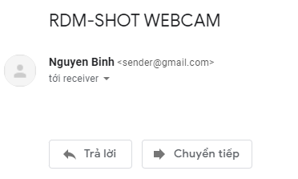
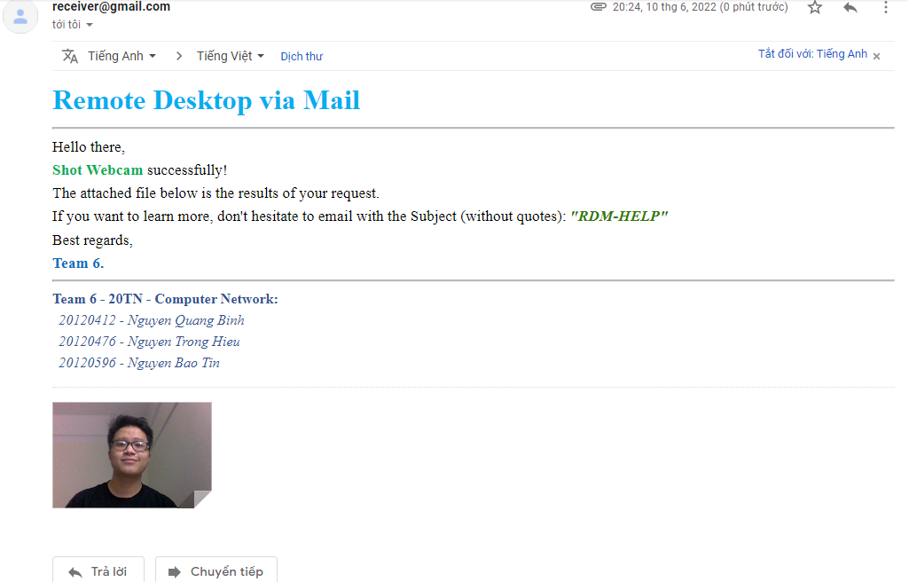
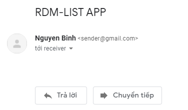
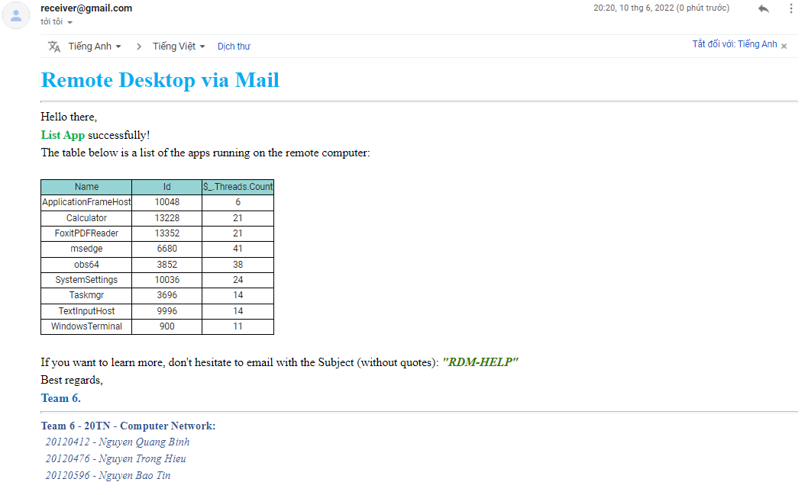
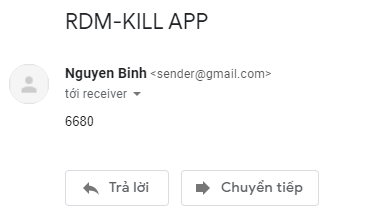
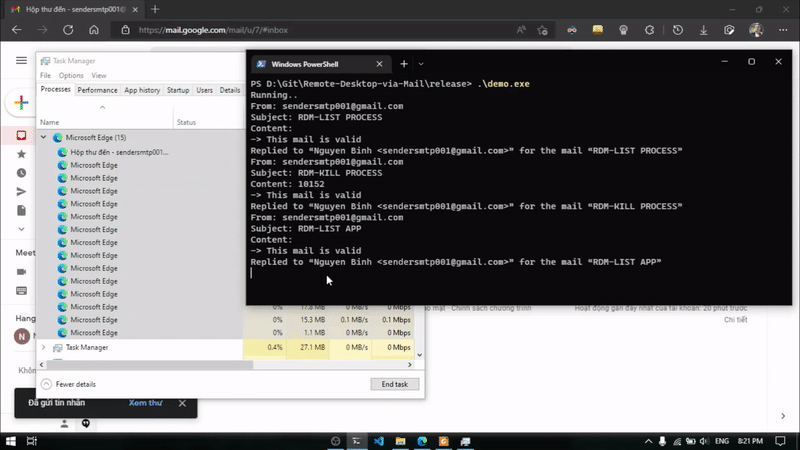

# Remote-Desktop-via-Mail

## 1. About
We will introduce briefly about our project:
<ul>
  <li>This is our final term project for Computer Networking course.</li>
  <li>Our program will ... </li>
  <li></li>
</ul>

## 2. Contributors:

|   Student ID   |            Name               | Profile 
|----------------|-------------------------------|----------------------------
|    20120412    |Nguyen Quang Binh | [@nqbinh47](https://github.com/nqbinh47)            
|    20120476    |Nguyen Trong Hieu | [@NguyenHiu](https://github.com/NguyenHiu)           
|    20120596    |Nguyen Bao Tin | [@nguyenbaotin](https://github.com/nguyenbaotin)


## 3. Installation
```shell
git clone https://github.com/nqbinh47/Remote-Desktop-via-Mail.git
cd Remote-Desktop-via-Mail
pip install -r requirements.txt
```
## 4. Demo

We choose 3 features to demo our project: <a href="#shotwebcam"> Shot webcam </a> and <a href="#listapp"> List applications </a> running on remote desktop and <a href="#killapp">Turn off a particular app</a> using its ID.<br>


### a. Shot webcam
<h5 id="shotwebcam"></h5>

To request to capture the webcam of the remote desktop, the first thing is to send a request email with the **Subject**:  ```RDM-SHOT WEBCAM``` and the **Content** is left blank.



Then, the request will be executed and mailed back to the user.



The attached file is what the webcam captured.


### b. List app
<h5 id="listapp"></h5>

**Send request email:** <br>
Just like shotting a webcam, the first thing to do is send a request mail with the  **Subject**:  ```RDM-LIST APP``` and the **Content** is left blank.



Then, the request will be executed and mailed back to the user.



The table is a list of apps that running on the remote desktop.


### c. Kill app
<h5 id="killapp"></h5>

 Each app has its own ID and you can turn it off by specifying the ID of the app in the **Content** of a new email. And of course the **Subject** must be ```RDM-KILL APP```



In this example, We are going to turn off Microsoft Egde (with ID is ```6680``` in the **List app** table above) and here's the result:

