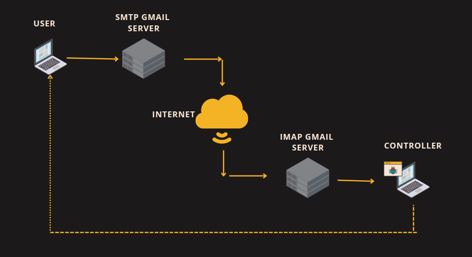

# Remote-Desktop-via-Mail
<p align="center">
  
</p>

**Content:**
<ul style="list-style-type: none">
    <li><a href="#about">About us</a></li>
    <li><a href="#install">Installation</a></li>
    <li><a href="#demo">Demo</a></li>
</ul>

<h5 id="about"></h5>

## 1. About us
We will introduce briefly about our project:
<ul>
  <li>This is our final project for Computer Networking course.</li>
  <li>Our program will ... </li>
  <li></li>
</ul>

### Contributors:

|   Student ID   |            Name               | Profile 
|----------------|-------------------------------|----------------------------
|    20120412    |Nguyen Quang Binh | [@nqbinh47](https://github.com/nqbinh47)            
|    20120476    |Nguyen Trong Hieu | [@NguyenHiu](https://github.com/NguyenHiu)           
|    20120596    |Nguyen Bao Tin | [@nguyenbaotin](https://github.com/nguyenbaotin)

<h5 id="install"></h5>

## 2. Installation
```shell
git clone https://github.com/nqbinh47/Remote-Desktop-via-Mail.git
cd Remote-Desktop-via-Mail
pip install -r requirements.txt
```


<h5 id="demo"></h5>

## 3. Demo
There are 21 commands and we choose 3 commands to demo 3 features in our project: <a href="#shotwebcam"> Shot webcam </a> and <a href="#listapp"> List applications </a> running on remote desktop and <a href="#killapp">Turn off a particular app</a> using its ID.

If you want to learn more about the remaining commands, please read the [document.](docs/Instruction.pdf)

<h5 id="shotwebcam"></h5>

### 3.1. Shot webcam

To request to capture the webcam of the remote desktop, the first thing is to send a request email with the **Subject**:  ```RDM-SHOT WEBCAM``` and the **Content** is left blank.


Then, the request will be executed and mailed back to the user.


The attached file is what the webcam captured.

<h5 id="listapp"></h5>

### 3.2. List app

**Send request email:** <br>
Just like shotting a webcam, the first thing to do is send a request mail with the  **Subject**:  ```RDM-LIST APP``` and the **Content** is left blank.


Then, the request will be executed and mailed back to the user.


The table is a list of apps that running on the remote desktop.


<h5 id="killapp"></h5>

### 3.3. Kill app 

 Each app has its own ID and you can turn it off by specifying the ID of the app in the **Content** of a new email. And of course the **Subject** must be ```RDM-KILL APP```


In this example, we are going to turn off Microsoft Egde (with ID is ```6680``` in the **List app** table above) and here's the result:


